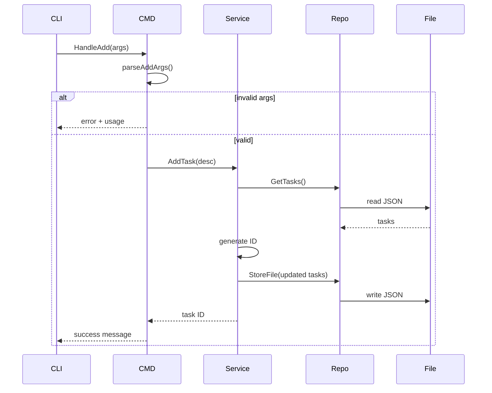

## ➕ ADD TASK

### Usage

```bash
todo add "Buy groceries"
```

### Description

Creates a new task with default status `todo`.

### Sequence Diagram


```mermaid
sequenceDiagram
    participant CLI
    participant CMD
    participant Service
    participant Repo
    participant File

    CLI->>CMD: HandleAdd(args)
    CMD->>CMD: parseAddArgs()
    alt invalid args
        CMD-->>CLI: error + usage
    else valid
        CMD->>Service: AddTask(desc)
        Service->>Repo: GetTasks()
        Repo->>File: read JSON
        File-->>Repo: tasks

        Service->>Service: generate ID
        Service->>Repo: StoreFile(updated tasks)
        Repo->>File: write JSON

        Service-->>CMD: task ID
        CMD-->>CLI: success message
    end
```
