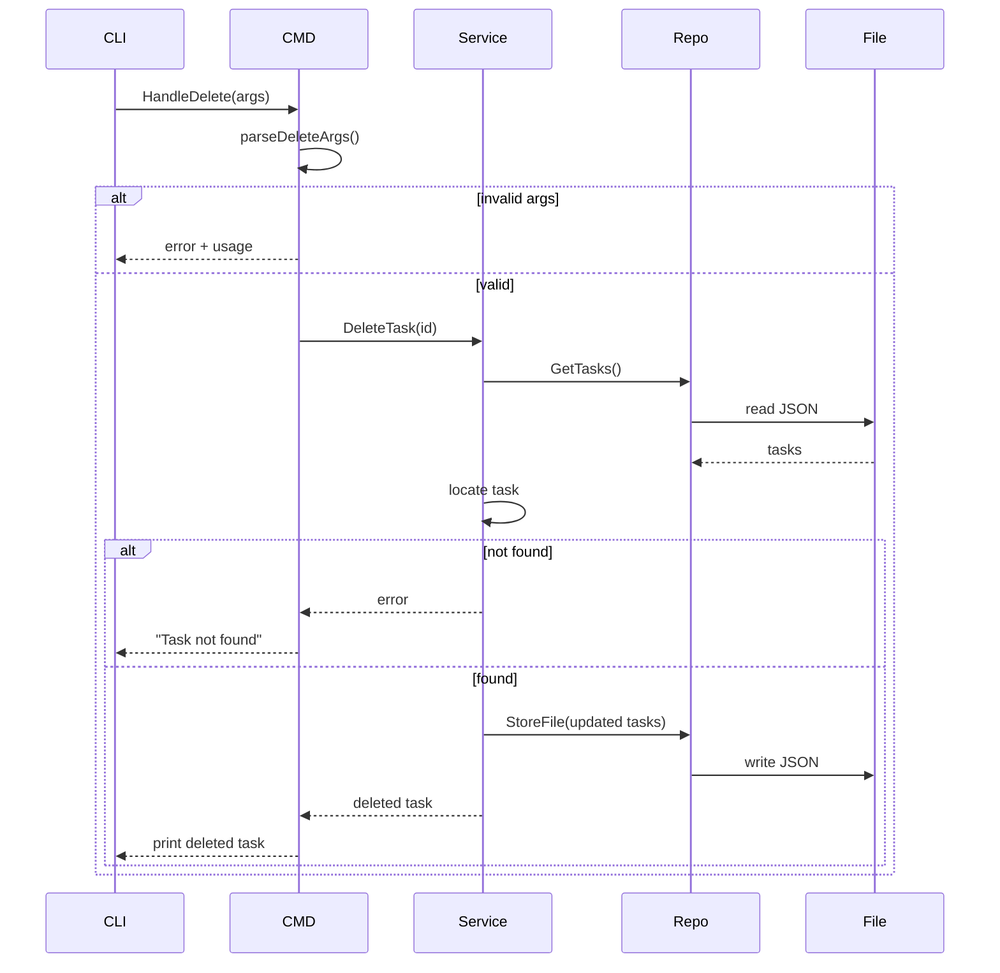

## ❌ DELETE TASK

### Usage

```bash
todo delete 1
```

### Description

Deletes a task by ID.

### Sequence Diagram


```mermaid
sequenceDiagram
    participant CLI
    participant CMD
    participant Service
    participant Repo
    participant File

    CLI->>CMD: HandleDelete(args)
    CMD->>CMD: parseDeleteArgs()

    alt invalid args
        CMD-->>CLI: error + usage
    else valid
        CMD->>Service: DeleteTask(id)
        Service->>Repo: GetTasks()
        Repo->>File: read JSON
        File-->>Repo: tasks

        Service->>Service: locate task

        alt not found
            Service-->>CMD: error
            CMD-->>CLI: "Task not found"
        else found
            Service->>Repo: StoreFile(updated tasks)
            Repo->>File: write JSON
            Service-->>CMD: deleted task
            CMD-->>CLI: print deleted task
        end
    end
```

---
