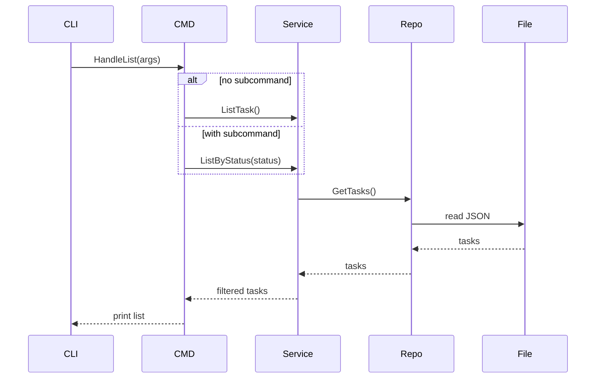

## 📋 LIST TASKS

### Usage

```bash
todo list
todo list done
```

### Description

Lists all tasks or filters by status.

### Sequence Diagram


```mermaid
sequenceDiagram
    participant CLI
    participant CMD
    participant Service
    participant Repo
    participant File

    CLI->>CMD: HandleList(args)

    alt no subcommand
        CMD->>Service: ListTask()
    else with subcommand
        CMD->>Service: ListByStatus(status)
    end

    Service->>Repo: GetTasks()
    Repo->>File: read JSON
    File-->>Repo: tasks
    Repo-->>Service: tasks

    Service-->>CMD: filtered tasks
    CMD-->>CLI: print list
```

---

## ✏️ UPDATE TASK
