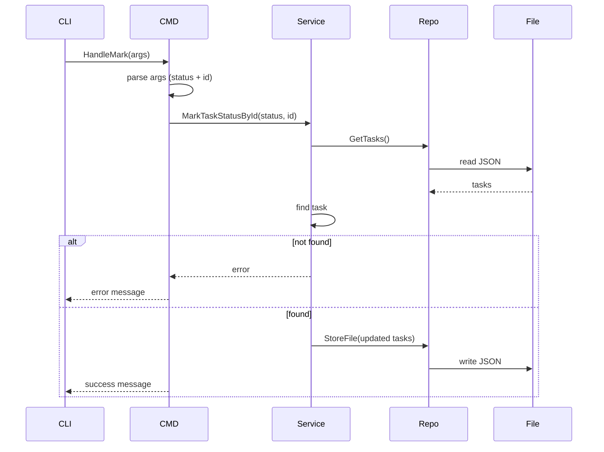

## ✅ MARK TASK

### Usage

```bash
todo mark done 1
```

### Description

Updates the status of a task.

### Sequence Diagram


```mermaid
sequenceDiagram
    participant CLI
    participant CMD
    participant Service
    participant Repo
    participant File

    CLI->>CMD: HandleMark(args)
    CMD->>CMD: parse args (status + id)

    CMD->>Service: MarkTaskStatusById(status, id)
    Service->>Repo: GetTasks()
    Repo->>File: read JSON
    File-->>Repo: tasks

    Service->>Service: find task

    alt not found
        Service-->>CMD: error
        CMD-->>CLI: error message
    else found
        Service->>Repo: StoreFile(updated tasks)
        Repo->>File: write JSON
        CMD-->>CLI: success message
    end
```
